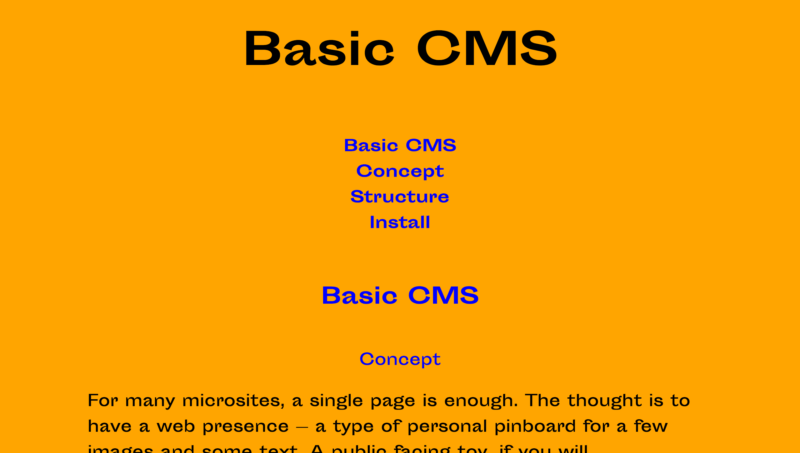
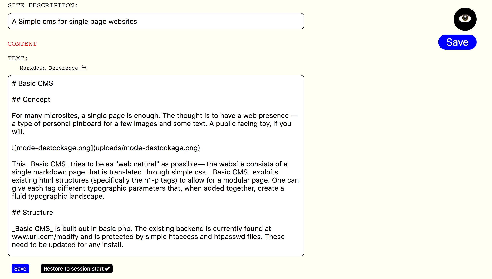

# Basic CMS
A php markdown-based single page cms. 

## Concept

For many microsites, I've found a single page is enough. The thought is to have a web presence — a type of personal pinboard for a few images and some text. A public facing, easily editable collection of thoughts, projects, whatever, etc.

This _Basic CMS_ tries to be as "web natural" as possible— the website consists of a single markdown page that is translated/styled through simple css. _Basic CMS_ exploits existing html structures (specifically the h1-p tags) to allow for a modular page. One can give each tag different typographic parameters that, when added together, create a fluid typographic landscape.

## Structure/Features

_Basic CMS_ is built out in php. The existing backend is currently found at yoururl/modify and is protected by simple htaccess and htpasswd files. _These need to be updated for any install_. 

- Content iterations are archived with each save. 
- Image upload supported by dropzone. 
- automatic menu filled with h1's and h2's pulled from content

This build currently uses local versions of Parsedown, dropzone, clibboard.js, and ImageResize to manage the website's markdown and image uploading/resizing. 

## Install

1. Download or clone this repo. 
2. place contents into a directory of your choice. 
3. Make sure you reveal your [hidden files](http://ianlunn.co.uk/articles/quickly-showhide-hidden-files-mac-os-x-mavericks/).
4. In the /modify folder, edit the .htaccess and .htpasswd files to reflect the proper filepath and username/password. (I'd recommend this [site](http://www.htaccesstools.com/htpasswd-generator/) to generate your .htpasswd and .htaccess files)
5. Edit the /build folder to customize any css, js etc. 
